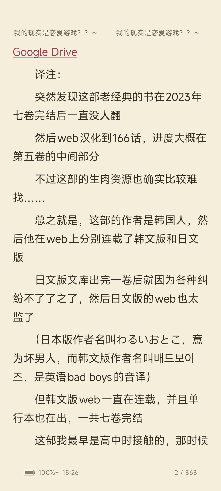
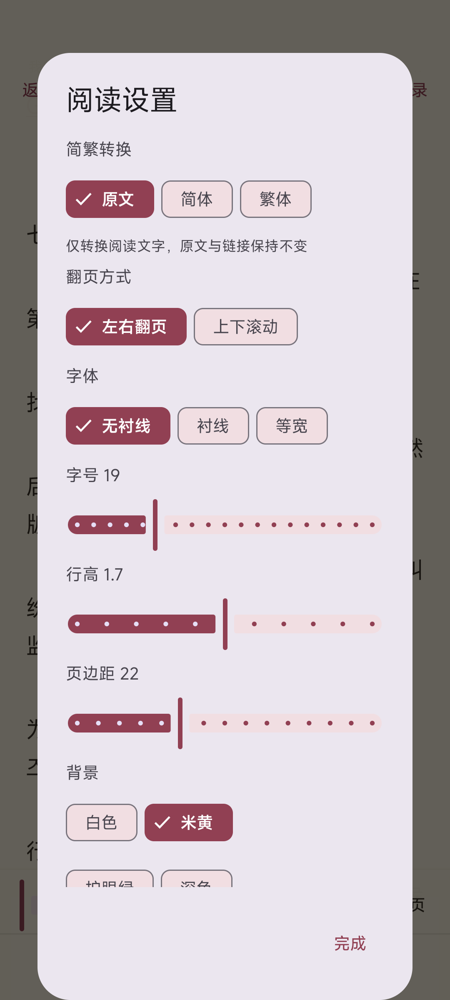

<p align="center">
  
</p>

# LightNovel Android

轻之国度（`lightnovel.fun`）的非官方 Android 客户端。项目基于 2026-08-06 实测的站点 Web BFF/API 实现，使用 Kotlin、Jetpack Compose 和 Material 3。

[下载最新 Release APK](https://github.com/jiangyuyi/lightnovel-android/releases/latest)
[度盘](https://pan.baidu.com/s/1mXTbkthYcq-4oMNX4AtCTA?pwd=yc85)  提取码: yc85

> 本项目仅用于学习与个人使用，不隶属于轻之国度。请遵守站点规则和内容版权要求，不要批量抓取、分发或商业使用站点内容。

## 已实现

- 用户名/邮箱密码登录、邮箱验证码注册、会话恢复与退出。
- 热门、排行、新书、原创、同人、EPUB、最近更新分区。
- 搜索分类、标签筛选和书籍跳转。
- 书籍详情、同书其他版本、分卷和章节目录。
- 登录后加入/移出书架、我的书架。
- 登录用户个人概览：头像、UID、用户组、轻币、关注/粉丝/发布统计。
- 关注与粉丝列表、关系状态、分页加载及带确认的关注切换。
- 云端阅读记录、续读跳转和带确认的单条删除。
- 发布管理：作品状态、审核进度、卷章/字数和公开详情跳转。
- 消息中心：私信、回复、@我、点赞、新粉丝、系统六类通知、未读徽标、分类分页与显式标为已读。
- 私信会话与只读消息线程；本版本不会自动标记已读，也不会发送私信。
- 正文阅读、上一章/下一章、目录返回、阅读进度保存。
- 沉浸式阅读隐藏系统状态栏和导航栏，顶部常驻书名和章节，点击长标题可查看全文；继续避让刘海和侧边挖孔，退出阅读恢复系统栏。
- 底部左侧显示电量和时间，右侧显示本章当前页 / 总页数；内缩、上移并结合实际圆角半径避让，底栏不覆盖正文。
- 点击阅读中心打开菜单，支持输入页码和滑动进度条快速定位；本章末页继续翻页可进入下一章。
- 阅读设置支持“原文 / 简体 / 繁体”离线转换并记住选择，基于 opencc4j；不修改缓存原文、图片及下载地址。
- 目录中的轻币章节可正常进入并显示价格与余额，通过官方网页完成解锁后自动刷新。
- 正文下载、普通网页和站外网盘链接可点击；直接文件交给 Android 系统下载，网盘地址交给浏览器或对应 App。
- 图书详情支持复制原始网页链接和调用系统分享。
- 两级内容缓存与稳定后台刷新：页面往返优先显示已有内容，刷新不清空列表；在线读过的章节正文可离线打开。
- 默认按屏幕自动排版并左右翻页，支持点击左右区域或横向滑动；也可切回上下滚动。
- 按原站 `body_html` 解析正文插图，将 `[res]...[/res]` 对应为真实图片并按正文顺序展示。
- 无衬线/衬线/等宽字体，14–32sp 字号、行高、页边距和白色/米黄/护眼绿/深色背景。
- 书籍评论匿名只读展示；评论故障不会影响书籍详情和阅读。
- Android Keystore 加密保存 `security_key`；不保存密码和验证码。
- “我的”页面最下方显示当前安装版本号，方便核对升级结果。

网站的独立“合集”分区目前标记为维护中。本客户端按实际可用的数据实现“书籍 → 分卷 → 章节”三级目录，并展示 `alternate_versions`；合集页会显示维护说明，不调用猜测接口。

完整的 API 调研、合集/评论评估、架构与验收计划见 [实施计划](docs/IMPLEMENTATION_PLAN.md)；账户功能和 1.2.0 消息中心设计见 [账户与消息计划](docs/ACCOUNT_AND_MESSAGES_PLAN.md)；1.3.0 缓存策略见 [缓存与稳定刷新计划](docs/CACHE_AND_REFRESH_PLAN.md)；1.4.1 锁定章节、下载和分享设计见 [对应实施计划](docs/LOCKED_CHAPTER_DOWNLOAD_SHARE_PLAN.md)。版本变更见 [CHANGELOG](CHANGELOG.md)。

## 截图

以下为 1.6.0 在 Xiaomi 25042PN24C 上的实机截图（2026-09-19），依次展示发现页、沉浸式阅读和阅读设置。

<p align="center">
  
  
  
</p>

阅读顶部与简繁转换见 [1.5.0 实现及验证](docs/READER_HEADER_AND_CHINESE_CONVERSION.md)，沉浸布局和圆角避让见 [1.6.0 实现及验证](docs/READER_IMMERSIVE_FOOTER.md)。旧版截图保留在目录中供历史参考。

## 构建

要求：

- JDK 17
- Android SDK 35
- 无需安装全局 Gradle

Windows：

```powershell
./gradlew.bat testDebugUnitTest lintDebug assembleDebug
```

macOS/Linux：

```bash
./gradlew testDebugUnitTest lintDebug assembleDebug
```

仓库优先使用阿里云的 Google Maven、Maven Central 和 Gradle Plugin Portal 镜像，并保留官方源回退。Gradle Wrapper 分发使用腾讯云镜像。若你的网络不能访问该镜像，可把 `gradle/wrapper/gradle-wrapper.properties` 的 `distributionUrl` 改回：

```text
https://services.gradle.org/distributions/gradle-8.9-bin.zip
```

Debug APK 生成于：

```text
app/build/outputs/apk/debug/app-debug.apk
```

### Release 签名

Release 构建强制要求签名，避免误发布未签名 APK。Windows 首次配置时运行：

```powershell
./scripts/setup-release-signing.ps1
```

脚本会在本机安全提示中读取签名密码，生成 `.signing/lightnovel-release.jks` 和 `signing.properties`，并通过已登录的 GitHub CLI 写入仓库 Actions Secrets。密码、私钥和本地签名配置均被 `.gitignore` 排除，不会提交到 Git。

请把 `.signing/lightnovel-release.jks` 与 `signing.properties` 离线备份；丢失签名密钥后将无法用相同应用 ID 发布可覆盖安装的更新。配置完成后可构建：

```powershell
./gradlew.bat testDebugUnitTest lintDebug assembleRelease
```

已签名 APK 生成于：

```text
app/build/outputs/apk/release/app-release.apk
```

### GitHub Release

`.github/workflows/release.yml` 会在推送 `v*` 标签时执行测试、Lint、签名构建、`apksigner` 验证，并发布 APK 与 SHA-256 校验文件：

```powershell
git tag v1.6.0
git push origin v1.6.0
```

也可以在 GitHub Actions 页面手动运行 `Android Release` 并填写版本标签。

发布前需更新 `app/build.gradle.kts` 中的 `versionName` 和递增的 `versionCode`，并在 CHANGELOG 添加同版本中文条目。Release 流程从标签读取版本名、从项目配置读取内部版本代码，并提取对应中文更新说明；沿用原签名可保留数据覆盖安装。

## 当前验证结果

- `testDebugUnitTest`：通过，包含认证错误提示、正文插图、账户资料、用户关系、阅读记录、发布作品、消息通知和私信解析。
- `lintDebug`：通过。
- `assembleDebug`：通过。
- `assembleRelease`：使用独立 Release 密钥签名，并通过 `apksigner verify`。
- 小米 Android 16 真机已验证：首页/分区、图片加载、书籍详情、分卷章节、分页正文、点击/滑动翻页、上下滚动兼容模式、字体字号与背景设置、用户手动登录、进程重启后的会话恢复、书架、个人概览、3 个关注、0 粉丝空状态、多条阅读记录及 0 个发布作品空状态。
- 1.2.0 消息中心真机验证：六类入口均可用；回复、@我、点赞、新粉丝正确显示空状态；系统通知加载 3 条历史记录；现有私信会话与只读线程成功加载。测试未执行标为已读或发送操作。
- 1.3.0 缓存真机验证：覆盖安装保留登录态；发现页和书架在进程重启后直接恢复缓存；书架后台刷新时旧列表保持可见；关闭 Wi-Fi/移动数据后仍可经缓存详情进入已读章节并显示完整 27 页正文。
- 1.4.1 真机验证：目录中的轻币章节可点击；用户在官方网页手动解锁 20 轻币章节后余额由 370 更新为 350，App 重新进入时自动用服务器状态替换旧锁定缓存并显示正文；书籍 `327` 的受限空章节会明确提示“没有权限访问该章节，或内容已删除”；另一章未购买的 20 轻币章节正确显示余额并在 App 内取消，未产生扣款；章节末页站外下载地址会先显示真实域名和确认框；图书分享生成精确的轻之国度原始地址。
- 密码由用户在手机上手动输入；测试过程未读取、记录或保存密码。临时加入的测试书籍已移出，书架恢复原状。
- 1.5.0：全量 51 项单元测试通过；真机验证书名/章节、离线简繁转换、重启保留设置、转换后的页码定位、末页续读和个人页版本显示。
- 1.6.0：测试、lint 与签名构建通过；真机验证隐藏系统栏、电量/时间更新、底部圆角避让、翻页更新页码及退出阅读后恢复系统栏，用户已确认布局效果。横屏、非充电和系统大字体未做专项实机测试。

## API 与隐私

应用只使用 HTTPS：

- Web BFF：`https://www.lightnovel.fun/api/pc-proxy/`
- 评论读取：`https://api.lightnovel.fun/pc-comment-proxy/`

站点没有为本项目提供稳定 SDK，因此 API 可能变化。API 与站点图片统一使用嵌入式 Cronet，优先建立 HTTP/3/QUIC 连接；遇到大陆网络上的可重试连接重置时会重建引擎并轮换备用 CDN 边缘地址。网络层同时集中处理响应信封、历史字段兼容和错误映射。Debug/Release 均不会记录密码、验证码或 `security_key`。

正文只缓存在当前设备供连续阅读，不随 Git 提交，也不提供整本离线导出。章节正文默认缓存 7 天，并与其他磁盘内容共同受 96 MiB LRU 上限约束。游客阅读设置和位置保存在 DataStore；登录用户的书架、阅读进度和阅读设置会按站点 API 同步。密码、验证码和 `security_key` 不进入内容缓存，退出登录会清理按 UID 隔离的私有缓存。

## 工程结构

```text
app/src/main/java/io/github/jiangyuyi/lightnovel/
├─ core/
│  ├─ data/          Repository
│  ├─ cache/         内存/SQLite 两级缓存、TTL 与 LRU
│  ├─ model/         书籍、分卷、章节、评论与阅读设置
│  ├─ network/       Cronet/QUIC、API 解包与兼容解析
│  ├─ preferences/   阅读偏好和本地进度
│  ├─ session/       Keystore 加密会话
│  └─ ui/            主题与通用组件
└─ feature/
   ├─ auth/
   ├─ book/
   ├─ bookshelf/
   ├─ discover/
   ├─ account/       关注、粉丝、阅读记录与发布管理
   ├─ messages/      六类消息、私信会话与只读线程
   ├─ profile/
   ├─ reader/
   └─ search/
```

## 已知限制

- 页码表示当前章节的分页结果，滚动模式显示段数；不会预加载整本书计算全书总页数。
- 简繁选项仅保存在本机，自动转换可能存在多音多义字歧义，可随时恢复原文；重新排版按段落保留位置，页码不保证完全一致。
- 站点接口可能临时返回 5xx，页面提供错误提示和重试。
- 独立合集频道维护中；当前实现以分卷和同书版本覆盖实际阅读结构。
- 评论为只读，发布、回复、点赞、图片上传和举报未实现。
- EPUB 频道正文中的单个下载链接可以打开或保存；不会批量抓取、整本导出或代解析网盘内容。
- 轻币解锁目前通过轻之国度官方网页完成，App 负责显示价格与余额并在返回后刷新，不调用未经验证的原生扣款接口。
- 发布管理当前为只读作品状态视图，完整作者编辑工作台尚未接入。
- 私信发送、通知内回复、动态、发帖尚未接入；消息中心与只读私信已在 1.2.0 实现。

## 许可证

客户端源代码使用 [MIT License](LICENSE)。站点内容、书籍正文、插图及轻之国度相关商标不因本许可证而改变其原有权利归属。
